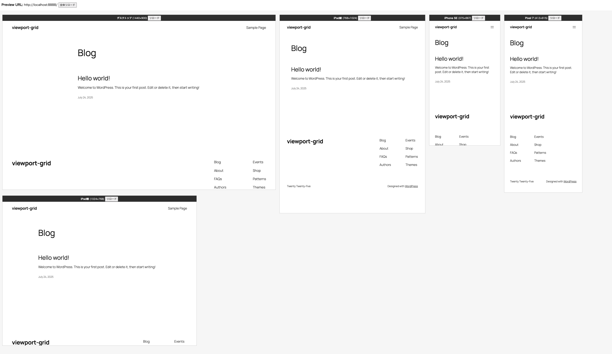

# Viewport Grid

Contributors: tarosky, Takahashi_Fumiki  
Tags: responsive, preview, viewport, grid, admin, design, development  
Stable tag: 1.0.0  
License: GPLv2 or later  
License URI: https://www.gnu.org/licenses/gpl-2.0.html

---

## 概要

**Viewport Grid** は、指定したURLを複数のビューポートサイズ（スマホ・タブレット・PCなど）で同時に表示し、レスポンシブデザインを一画面で比較・検証できるWordPress管理者向けプラグインです。主にデザイナー・開発者がモバイル対応を確認する用途で使用します。

---

## 主な特徴

- 管理画面でビューポートサイズ（ラベル・横幅・縦幅）を自由に設定
- `/multi-preview/?preview=URL` で複数のiframeを並べて同時表示
- 各ビューポートごとにリロードボタン、全体リロードボタン
- ドラッグ＆ドロップでプレビュー画面の並び替え（Packery + Draggabilly）
- 設定画面でビューポートの順番もドラッグで変更可能
- X-Frame-Options: DENYなページは表示不可
- 管理画面は `manage_options` 権限で制限

---

## インストール方法

1. このリポジトリのリリースからZIPをダウンロードし、`viewport-grid.zip`をアップロード。
2. WordPress管理画面の「プラグイン」から「Viewport Grid」を有効化します。
3. 必要に応じて `npm install && npm run wp-env start` でローカル開発環境を起動できます。

---

## 使い方

1. 管理画面「ツール」→「Viewport Grid」からビューポートサイズを設定
2. プレビューしたいURLを入力し、「プレビューを開く」ボタンで新しいタブに比較画面を表示
3. `/multi-preview/?preview=URL` でも直接アクセス可能
4. プレビュー画面で各ビューポートをドラッグ＆ドロップで並べ替え可能

---

## 設定

- ビューポートサイズ（ラベル・横幅・縦幅）は複数登録・編集・削除・並べ替え可能
- 設定は `wp_options` の `viewport_grid_settings` に保存
- 外部から `viewport_grid_viewports` フィルターでカスタマイズ可能

---

## FAQ

**Q. 外部サイトもプレビューできますか？**  
A. X-Frame-Options: DENY などが設定されている外部サイトは表示できません。基本的に自サイト内ページのプレビューを想定しています。

**Q. プレビュー画面の並び順は保存されますか？**  
A. プレビュー画面での並び順は一時的なものです。設定画面で順番を保存できます。

**Q. プラグインのカスタマイズは可能ですか？**  
A. フィルターやフックを用意しています。詳細はソースコードをご参照ください。

---

## ライセンス

GPLv2 or later

---

## 作者情報

- 作者: Tarosky INC.  
- GitHub: [https://github.com/tarosky/viewport-grid](https://github.com/tarosky/viewport-grid)

---

## Changelog

### 1.0.0
- 初回リリース 
